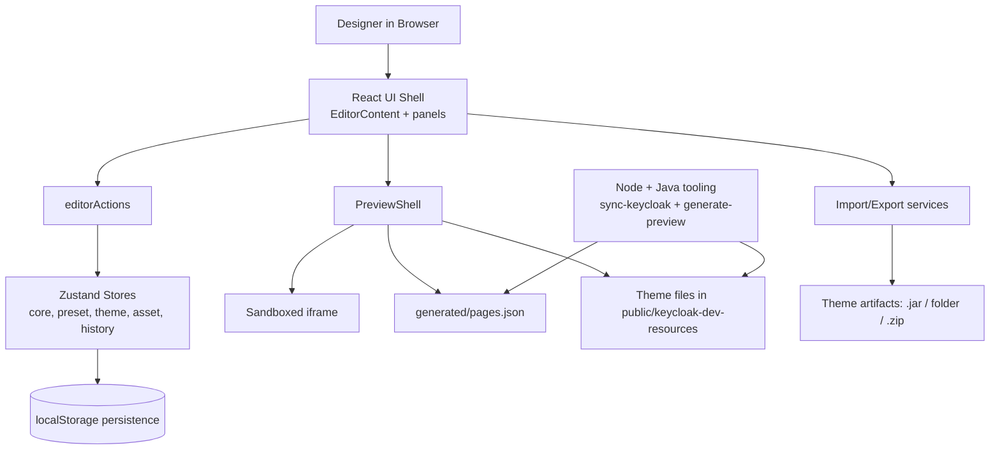

# Keycloak Theme Editor

A browser-based visual editor for designing, previewing, and exporting Keycloak login themes.

## Quick Start

```bash
npm install
npm run dev
```

Open the URL shown in terminal (default: `http://localhost:5173`).

### Docker Image

If you want to run the theme editor in a Docker container, you can use the following command:

```shell
docker run --name keycloak-theme-editor -p 5173:5173 -v $(pwd):/app -w /app node:alpine sh -c "npm install && npm run dev -- --host"
```

## Features

| | |
|---|---|
| **Design** | Apply presets, quick-start controls (colors, fonts, radius, shadow), or edit CSS directly in CodeMirror |
| **Assets** | Upload fonts, backgrounds, logos, favicon, and images |
| **Preview** | Browse generated Keycloak pages across desktop/tablet/mobile viewports and dark mode |
| **Export** | Download as deployable `.jar` or quick-export to a folder (Chrome/Edge) |
| **Import** | Re-import a previously exported theme JAR |

## Scripts

| Command | Description |
|---|---|
| `npm run dev` | Dev server |
| `npm run build` | Type-check + production build |
| `npm run test:run` | Run tests once |
| `npm run lint` | ESLint |
| `npm run sync:keycloak` | Sync upstream Keycloak templates into `public/keycloak-upstream/` |
| `npm run generate:preview` | Regenerate preview `pages.json` (with embedded scenarios) |

## Add Custom Preview Page

Use this when you add a custom login page and want it selectable in the preview editor.

### 1. Add the FTL template

Place your page in the base theme folder:

`public/keycloak-dev-resources/themes/base/login/<your-page>.ftl`

Use the standard Keycloak layout wrapper:

```ftl
<#import "template.ftl" as layout>
<@layout.registrationLayout displayMessage=false displayInfo=false; section>
  <#if section = "header">
    My Custom Page
  <#elseif section = "form">
    <div id="kc-form">...</div>
  </#if>
</@layout.registrationLayout>
```

### 2. Register the page mock

In `tools/kc-context-mocks/kc-page.ts`, add your page to `kcContextExtensionPerPage` with its custom context fields:

```typescript
kcContextExtensionPerPage: {
  'my-custom-page.ftl': {
    myField: 'some value',
  },
},
```

Standard Keycloak pages (login, register, etc.) are already provided by keycloakify — only custom pages need to be registered here.

### 3. Add story variants (optional)

To preview different states of your page, add entries in `tools/kc-context-mocks/kc-page-story.ts`:

```typescript
export const stories = {
  'my-custom-page': {
    'error-state': {
      message: { type: 'error', summary: 'Something went wrong' },
    },
  },
}
```

### 4. Generate and preview

```bash
npm run generate:preview
npm run dev
```

## Requirements

- **Node.js 18+** (20+ recommended), npm
- **JDK 25+** and **Maven** — only needed for preview artifact generation

## Tech Stack

React 19 and PatternFly

## Architecture Diagram



## Project Structure

```
src/
  app/              # Editor shell & wiring
  components/       # Sidebar, topbar, panels
  features/
    assets/         # Upload & asset management
    editor/         # CSS editing, undo/redo, style layers
    presets/         # Preset selection logic
    preview/        # Iframe preview & generated artifacts
    theme-export/   # JAR/folder export & import
  styles/           # Constants & shared styles

public/
  keycloak-dev-resources/   # Shared dev resources and base theme resources (bases/base, bases/v2)
    themes/<theme-id>/      # Theme files:
                            # - styles.css + quick-start.css: export/runtime CSS
                            # - preview.css: editor-preview-only CSS (never exported)

tools/
  keycloak-sync/        # Upstream template sync
  preview-renderer/     # Java-based preview generation
```
